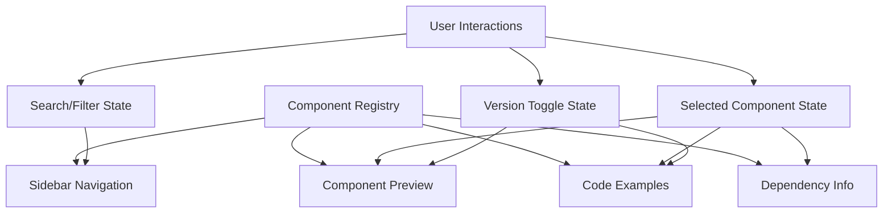

# Design Document

## Overview

This design outlines the creation of a comprehensive component showcase application that serves as both documentation and testing environment for UI components. The showcase will display all available components from both the original shadcn/ui library and the new CSS modules version (shadcss-ui), providing live examples, code snippets, dependency information, and interactive demonstrations.

The design leverages the existing Next.js application structure and builds upon the current component categorization system while significantly enhancing the user experience with advanced features like search, filtering, code copying, and version switching.

## Architecture

### Application Structure

```
src/app/components/
├── page.tsx                    # Enhanced main showcase page
├── showcase/
│   ├── page.tsx               # New unified showcase interface
│   ├── components/
│   │   ├── ComponentSidebar.tsx
│   │   ├── ComponentPreview.tsx
│   │   ├── CodeBlock.tsx
│   │   ├── DependencyInfo.tsx
│   │   └── VersionToggle.tsx
│   └── lib/
│       ├── component-registry.ts
│       ├── code-examples.ts
│       └── dependency-map.ts
```

### Component Architecture

The showcase will be built using a modular architecture with the following key components:

1. **ComponentSidebar**: Alphabetically organized navigation with search and filtering
2. **ComponentPreview**: Live component demonstrations with variant examples
3. **CodeBlock**: Syntax-highlighted, copyable code snippets
4. **DependencyInfo**: Library dependency information and installation guides
5. **VersionToggle**: Switch between shadcn/ui and CSS modules versions

### Data Flow Architecture



## Components and Interfaces

### Component Registry System

The core of the showcase will be a comprehensive component registry that maps all available components with their metadata:

```typescript
interface ComponentInfo {
  id: string
  name: string
  description: string
  category: 'basic' | 'layout' | 'feedback' | 'navigation' | 'data' | 'overlay'
  dependencies: ComponentDependency[]
  variants: ComponentVariant[]
  examples: ComponentExample[]
  hasOriginalVersion: boolean
  hasCssModulesVersion: boolean
  radixPackage?: string
  externalLibraries?: string[]
}

interface ComponentDependency {
  name: string
  version: string
  type: 'peer' | 'direct'
  description: string
  installCommand: string
  documentationUrl?: string
}

interface ComponentVariant {
  name: string
  description: string
  props: Record<string, any>
}

interface ComponentExample {
  title: string
  description: string
  code: string
  component: React.ComponentType
  variants?: ComponentVariant[]
}
```

### Enhanced Sidebar Navigation

The sidebar will provide comprehensive navigation with advanced features:

```typescript
interface SidebarProps {
  components: ComponentInfo[]
  selectedComponent: string | null
  onComponentSelect: (componentId: string) => void
  searchQuery: string
  onSearchChange: (query: string) => void
  categoryFilter: string | null
  onCategoryFilterChange: (category: string | null) => void
}

interface SidebarState {
  isCollapsed: boolean
  searchResults: ComponentInfo[]
  filteredComponents: ComponentInfo[]
}
```

### Component Preview System

The preview system will render live examples with full interactivity:

```typescript
interface PreviewProps {
  component: ComponentInfo
  selectedVariant?: string
  version: 'original' | 'css-modules'
  onVariantChange: (variant: string) => void
}

interface PreviewState {
  activeExample: number
  interactionState: Record<string, any>
}
```

### Code Display System

Advanced code display with syntax highlighting and copy functionality:

```typescript
interface CodeBlockProps {
  code: string
  language: 'typescript' | 'tsx' | 'css'
  title?: string
  showLineNumbers?: boolean
  highlightLines?: number[]
  copyable?: boolean
}

interface CodeExampleProps {
  component: ComponentInfo
  example: ComponentExample
  version: 'original' | 'css-modules'
  showImports?: boolean
}
```

## Data Models

### Component Registry Data

The component registry will be built from analyzing the existing component structure:

```typescript
// Auto-generated from file system analysis
const COMPONENT_REGISTRY: ComponentInfo[] = [
  {
    id: 'button',
    name: 'Button',
    description: 'Clickable button component with multiple variants',
    category: 'basic',
    dependencies: [
      {
        name: '@radix-ui/react-slot',
        version: '^1.2.3',
        type: 'direct',
        description: 'Provides slot functionality for polymorphic components',
        installCommand: 'npm install @radix-ui/react-slot'
      },
      {
        name: 'class-variance-authority',
        version: '^0.7.1',
        type: 'direct',
        description: 'Utility for creating variant-based component APIs',
        installCommand: 'npm install class-variance-authority'
      }
    ],
    variants: [
      { name: 'default', description: 'Primary button style', props: { variant: 'default' } },
      { name: 'secondary', description: 'Secondary button style', props: { variant: 'secondary' } },
      { name: 'destructive', description: 'Destructive action button', props: { variant: 'destructive' } },
      { name: 'outline', description: 'Outlined button style', props: { variant: 'outline' } },
      { name: 'ghost', description: 'Minimal button style', props: { variant: 'ghost' } },
      { name: 'link', description: 'Link-styled button', props: { variant: 'link' } }
    ],
    examples: [
      {
        title: 'Basic Usage',
        description: 'Simple button with different variants',
        code: `import { Button } from "@/components/shadcss-ui/button"

export function ButtonDemo() {
  return (
    <div className="flex gap-2">
      <Button variant="default">Default</Button>
      <Button variant="secondary">Secondary</Button>
      <Button variant="destructive">Destructive</Button>
    </div>
  )
}`,
        component: ButtonDemo
      }
    ],
    hasOriginalVersion: true,
    hasCssModulesVersion: true,
    radixPackage: '@radix-ui/react-slot'
  }
  // ... additional components
]
```

### Search and Filter State

```typescript
interface ShowcaseState {
  selectedComponent: string | null
  searchQuery: string
  categoryFilter: string | null
  versionPreference: 'original' | 'css-modules' | 'auto'
  sidebarCollapsed: boolean
  codeViewExpanded: boolean
}

interface SearchResult {
  component: ComponentInfo
  matchScore: number
  matchedFields: string[]
}
```

## Error Handling

### Component Loading Errors
- **Graceful Fallbacks**: Display error boundaries for failed component renders
- **Missing Components**: Show placeholder content when components aren't available
- **Version Conflicts**: Handle cases where only one version exists

### Code Generation Errors
- **Syntax Highlighting**: Fallback to plain text if highlighting fails
- **Code Copying**: Provide manual selection if clipboard API fails
- **Dynamic Imports**: Handle module loading failures gracefully

### Search and Navigation Errors
- **Empty Results**: Provide helpful suggestions when no components match
- **URL Routing**: Handle invalid component IDs in URLs
- **State Persistence**: Recover from localStorage corruption

## Testing Strategy

### Component Showcase Testing
1. **Visual Regression**: Automated screenshots of all component examples
2. **Interaction Testing**: Verify all interactive examples work correctly
3. **Accessibility Testing**: Ensure keyboard navigation and screen reader support
4. **Responsive Testing**: Test layout on different screen sizes

### Code Example Validation
1. **Syntax Validation**: Ensure all code examples are syntactically correct
2. **Import Resolution**: Verify all imports resolve correctly
3. **Type Checking**: Run TypeScript validation on all examples
4. **Runtime Testing**: Execute code examples to ensure they work

### Search and Filter Testing
1. **Search Accuracy**: Test search results relevance and accuracy
2. **Filter Combinations**: Test various filter combinations
3. **Performance Testing**: Ensure search remains fast with large datasets
4. **Edge Cases**: Test empty queries, special characters, etc.

## Implementation Phases

### Phase 1: Core Infrastructure
- Create component registry system
- Build basic sidebar navigation
- Implement component preview framework
- Set up routing and state management

### Phase 2: Enhanced Features
- Add search and filtering functionality
- Implement code display with syntax highlighting
- Create dependency information system
- Add version switching capability

### Phase 3: Advanced Functionality
- Implement code copying and sharing
- Add responsive design and mobile optimization
- Create accessibility enhancements
- Add performance optimizations

### Phase 4: Polish and Documentation
- Comprehensive testing and bug fixes
- Performance optimization
- Documentation and usage guides
- SEO and metadata optimization

## User Experience Design

### Navigation Flow
1. **Landing**: Users arrive at enhanced component overview page
2. **Discovery**: Browse categories or use search to find components
3. **Exploration**: Click component to see detailed examples and code
4. **Implementation**: Copy code examples and dependency information
5. **Comparison**: Switch between original and CSS modules versions

### Responsive Design Strategy
- **Desktop**: Full sidebar with detailed component information
- **Tablet**: Collapsible sidebar with touch-friendly interactions
- **Mobile**: Bottom sheet navigation with swipe gestures

### Accessibility Features
- **Keyboard Navigation**: Full keyboard support for all interactions
- **Screen Reader Support**: Proper ARIA labels and announcements
- **High Contrast**: Support for high contrast mode
- **Focus Management**: Clear focus indicators and logical tab order

## Performance Considerations

### Code Splitting
- **Component Lazy Loading**: Load component examples on demand
- **Route-based Splitting**: Split showcase routes for faster initial load
- **Dynamic Imports**: Load syntax highlighting and other heavy libraries asynchronously

### Caching Strategy
- **Component Registry**: Cache component metadata in localStorage
- **Code Examples**: Cache generated code examples
- **Search Index**: Pre-build and cache search index for fast filtering

### Bundle Optimization
- **Tree Shaking**: Ensure unused components are eliminated
- **Code Minification**: Optimize JavaScript and CSS bundles
- **Image Optimization**: Optimize any icons or images used

## SEO and Metadata

### Search Engine Optimization
- **Dynamic Meta Tags**: Generate appropriate meta tags for each component
- **Structured Data**: Add JSON-LD markup for component information
- **Sitemap Generation**: Create sitemap including all component pages
- **URL Structure**: Clean, descriptive URLs for each component

### Social Sharing
- **Open Graph Tags**: Rich previews when sharing component pages
- **Twitter Cards**: Optimized cards for Twitter sharing
- **Preview Images**: Generate preview images for each component

## Security Considerations

### Code Execution Safety
- **Sandboxed Examples**: Ensure component examples can't execute malicious code
- **Input Sanitization**: Sanitize any user-generated content in search
- **XSS Prevention**: Prevent cross-site scripting in code display

### Data Privacy
- **Local Storage**: Minimize data stored locally
- **Analytics**: Implement privacy-friendly analytics if needed
- **Third-party Dependencies**: Audit all dependencies for security issues

## Integration Points

### Existing Application Integration
- **Theme System**: Integrate with existing theme provider
- **Navigation**: Maintain consistency with existing navigation patterns
- **Component Library**: Seamlessly integrate with both component versions

### External Tool Integration
- **Development Tools**: Support for React DevTools and other debugging tools
- **Build System**: Integration with Next.js build and development processes
- **Version Control**: Consider integration with Git for component versioning

## Future Enhancements

### Advanced Features
- **Component Playground**: Interactive editor for testing component props
- **Theme Customization**: Live theme editing and preview
- **Export Functionality**: Export component configurations
- **Usage Analytics**: Track which components are most viewed/copied

### Community Features
- **User Contributions**: Allow community-contributed examples
- **Rating System**: Let users rate component examples
- **Comments**: Discussion system for component usage
- **Favorites**: Allow users to bookmark favorite components