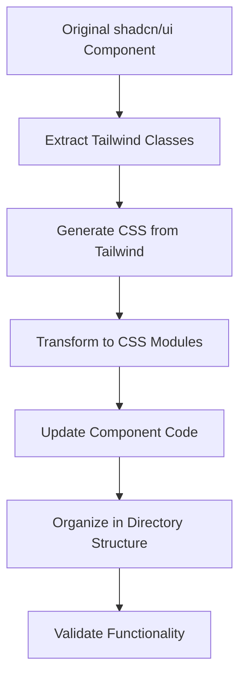

# Design Document

## Overview

This design outlines the systematic conversion of all 45 shadcn/ui components from Tailwind CSS to CSS modules. The conversion will create a new component library structure in `src/components/shadcss-ui/` where each component has its own directory containing both the TypeScript component file and its corresponding CSS module file.

The design leverages the existing `tw-to-css.js` conversion script as a foundation while extending it to handle the complete component library transformation with proper organization and enhanced CSS generation.

## Architecture

### Directory Structure

```
src/components/shadcss-ui/
├── accordion/
│   ├── index.tsx
│   └── accordion.module.css
├── alert-dialog/
│   ├── index.tsx
│   └── alert-dialog.module.css
├── button/
│   ├── index.tsx
│   └── button.module.css
└── ... (43 more components)
```

### Component Architecture

Each converted component will maintain:
- **Same TypeScript interface**: Props, exports, and functionality remain identical
- **CSS module integration**: Tailwind classes replaced with CSS module class references
- **Variant support**: CVA (class-variance-authority) patterns converted to CSS module equivalents
- **Composition patterns**: Compound components and slot-based composition preserved

### Conversion Pipeline



## Components and Interfaces

### Enhanced Conversion Script

The existing `tw-to-css.js` script will be extended with:

1. **Batch Processing**: Process all components in `src/components/ui/` automatically
2. **Directory Creation**: Generate the new `shadcss-ui` directory structure
3. **Component Code Transformation**: Update TypeScript files to use CSS modules
4. **CSS Module Generation**: Create properly formatted CSS module files
5. **Variant Handling**: Convert CVA patterns to CSS module equivalents

### CSS Module Structure

Each CSS module will follow this pattern:

```css
/* Base component styles */
.componentName {
  /* Base styles */
}

/* Variant styles */
.variant-default {
  /* Default variant styles */
}

.variant-destructive {
  /* Destructive variant styles */
}

/* Size styles */
.size-sm {
  /* Small size styles */
}

.size-lg {
  /* Large size styles */
}

/* State styles */
.componentName:hover {
  /* Hover styles */
}

.componentName:focus {
  /* Focus styles */
}

/* Responsive styles */
@media (min-width: 768px) {
  .componentName {
    /* Responsive styles */
  }
}
```

### Component Code Transformation

Components will be transformed to use CSS modules:

```typescript
// Before (Tailwind)
const buttonVariants = cva(
  "inline-flex items-center justify-center...",
  {
    variants: {
      variant: {
        default: "bg-primary text-primary-foreground...",
        destructive: "bg-destructive text-white..."
      }
    }
  }
)

// After (CSS Modules)
import styles from './button.module.css'

const buttonVariants = cva(
  styles.button,
  {
    variants: {
      variant: {
        default: styles['variant-default'],
        destructive: styles['variant-destructive']
      }
    }
  }
)
```

## Data Models

### Component Metadata

```typescript
interface ComponentMetadata {
  name: string
  originalPath: string
  newPath: string
  dependencies: string[]
  variants: VariantConfig[]
  extractedClasses: string[]
}

interface VariantConfig {
  name: string
  values: Record<string, string>
}
```

### Conversion Result

```typescript
interface ConversionResult {
  component: ComponentMetadata
  cssModule: string
  transformedCode: string
  success: boolean
  errors: string[]
}
```

## Error Handling

### CSS Generation Errors
- **Fallback CSS**: If Tailwind CSS generation fails, provide manual CSS equivalents
- **Class Mapping**: Maintain a mapping of common Tailwind classes to CSS properties
- **Validation**: Verify generated CSS produces expected visual results

### Component Transformation Errors
- **AST Parsing**: Handle TypeScript parsing errors gracefully
- **Import Resolution**: Ensure all imports are correctly updated
- **Type Safety**: Maintain TypeScript compatibility throughout conversion

### Dependency Management
- **Radix UI**: Preserve all Radix UI component dependencies
- **External Libraries**: Maintain compatibility with class-variance-authority, clsx, etc.
- **Internal Dependencies**: Update cross-component imports to use new structure

## Testing Strategy

### Visual Regression Testing
1. **Component Snapshots**: Generate visual snapshots of original components
2. **Conversion Validation**: Compare converted components against originals
3. **Variant Testing**: Ensure all variants render identically
4. **Responsive Testing**: Verify responsive behavior is preserved

### Functional Testing
1. **Props Interface**: Verify all props work identically
2. **Event Handling**: Ensure event handlers function correctly
3. **Accessibility**: Validate ARIA attributes and keyboard navigation
4. **Composition**: Test compound components and slot patterns

### Integration Testing
1. **Build Process**: Ensure CSS modules work with Next.js build
2. **TypeScript**: Verify type checking passes
3. **Import Resolution**: Test component imports from new locations
4. **Performance**: Compare bundle sizes and runtime performance

## Implementation Phases

### Phase 1: Infrastructure Setup
- Enhance conversion script for batch processing
- Create directory structure generation
- Implement CSS module formatting improvements

### Phase 2: Core Components
- Convert foundational components (Button, Card, Input, Label)
- Establish patterns for variant handling
- Validate conversion quality

### Phase 3: Complex Components
- Convert components with multiple variants (Alert, Badge, etc.)
- Handle compound components (Dialog, Dropdown Menu, etc.)
- Address advanced styling patterns

### Phase 4: Specialized Components
- Convert data display components (Table, Chart, etc.)
- Handle form components with complex interactions
- Convert navigation components

### Phase 5: Validation and Optimization
- Comprehensive testing across all components
- Performance optimization
- Documentation updates

## CSS Module Naming Conventions

### Base Classes
- Component name: `.button`, `.card`, `.input`
- Descriptive and semantic naming

### Variant Classes
- Variant type prefix: `.variant-default`, `.variant-destructive`
- Size prefix: `.size-sm`, `.size-lg`
- State modifiers: `.state-active`, `.state-disabled`

### Utility Classes
- Spacing: `.spacing-sm`, `.spacing-lg`
- Colors: `.color-primary`, `.color-destructive`
- Typography: `.text-sm`, `.text-lg`

## Performance Considerations

### CSS Bundle Size
- **Tree Shaking**: Ensure unused CSS is eliminated
- **Critical CSS**: Identify and prioritize critical component styles
- **Compression**: Optimize CSS output for production builds

### Runtime Performance
- **Class Application**: Minimize dynamic class calculations
- **CSS Custom Properties**: Use for theme values and dynamic styling
- **Selector Efficiency**: Ensure CSS selectors are performant

## Migration Strategy

### Gradual Adoption
- **Parallel Structure**: Keep original components during transition
- **Component-by-Component**: Allow incremental migration
- **Import Aliases**: Provide easy switching between versions

### Developer Experience
- **Documentation**: Clear migration guides for each component
- **Type Definitions**: Maintain identical TypeScript interfaces
- **Tooling**: Provide automated migration scripts where possible